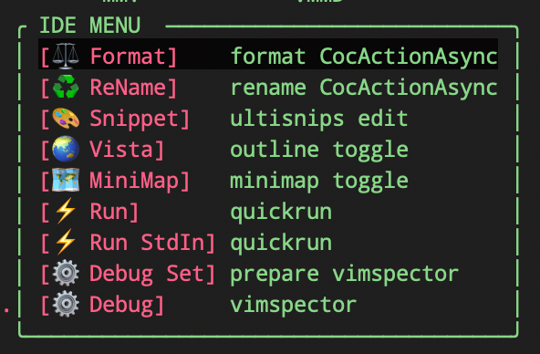

# vim-IDE-menu
vim IDE action menu on popup


Everybody set filer `<leader>f`, go-to-def `<leader>d`or`gd`, show-refs `<leader>r` ...

but too many features in IDE with LSP.

You have to remember a lot of keymap... it's confusing.

So I made a menu including infrequent features, then aggregated a single keymap.

# Dependency
|Features|Dependency|
|:----|:-------|
|Format|[coc.nvim](https://github.com/neoclide/coc.nvim)|
|ReName|[coc.nvim](https://github.com/neoclide/coc.nvim)|
|Snippet|[UltiSnips](https://github.com/SirVer/ultisnips)|
|Vista|[vista.vim](https://github.com/liuchengxu/vista.vim)|
|MiniMap|[minimap.vim](https://github.com/wfxr/minimap.vim)|
|Run|[vim-quickrun](https://github.com/thinca/vim-quickrun)|
|Debug|[vimspector](https://github.com/puremourning/vimspector)|

# Usage
`<Leader>v` to open menu in popup window.

and keymap vimspector features just like `eclipse`.
```vim
nnoremap <F3> :cal execute('VimspectorWatch '.expand('<cword>'))<CR>
nnoremap <F4> <Plug>VimspectorRestart
nnoremap <F5> <Plug>VimspectorStepInto
nnoremap <F6> <Plug>VimspectorStepOver
nnoremap <F7> <Plug>VimspectorStepOut
nnoremap <F8> <Plug>VimspectorContinue
nnoremap <F9> <Plug>VimspectorToggleBreakpoint
nnoremap <F10> :VimspectorReset<CR>
```

to preset install debugger
```vim
:VimspectorInstall debugpy delve CodeLLDB
```

And, you have to prepare `.vimspector.json` on project file.

This is cmd to copy `.vimspector.json` file from this repo installed by [`junegunn/vim-plug`](https://github.com/junegunn/vim-plug).
```vim
:VimspectorProfileInit
```

like (this plugin read current budder `&filetype` and call profile.)
```json
{
    "adapters": {
        "custom-codelldb": {
            "extends": "CodeLLDB",
            "command": [
                "$HOME/.vim/plugged/vimspector/gadgets/macos/CodeLLDB/adapte/codelldb",
                "--port",
                "${unusedLocalPort}"
            ]
        },
        "CodeLLDB - StopOnEntry": {
            "extends": "custom-codelldb",
            "name": "CoHostingLLDB"
        }
    },
    "configurations": {
        "cpptools (lldb)": {
            "adapter": "vscode-cpptools",
            "filetypes": [
                "cpp"
            ],
            "default": true,
            "variables": {
                "BUILDME": {
                    "shell": "g++ -o ${workspaceRoot}/test -g -std=c++20 ${workspaceRoot}/main.cpp"
                },
                "arch": {
                    "shell": "uname -m"
                }
            },
            "configuration": {
                "name": "C++: Current File",
                "type": "cpp",
                "request": "launch",
                "program": "${workspaceRoot}/test",
                "stopAtEntry": true,
                "externalConsole": true,
                "console": "integratedTerminal",
                "MIMode": "lldb",
                "MIDebuggerPath": "$HOME/.vim/plugged/vimspector/gadgets/macos/vscode-cpptools/debugAdapters/lldb-mi/bin/lldb-mi",
                "logging": {
                    "engineLogging": true
                },
                "targetArchitecture": "${arch}"
            },
            "breakpoints": {
                "exception": {
                    "raised": "Y",
                    "caught": "Y",
                    "uncaught": "Y",
                    "cpp_throw": "Y",
                    "cpp_catch": "Y"
                }
            }
        },
        "python": {
            "adapter": "debugpy",
            "filetypes": [
                "python"
            ],
            "default": true,
            "configuration": {
                "name": "Python: Current File",
                "type": "python",
                "request": "launch",
                "cwd": "${cwd}",
                "program": "${file}",
                "stopOnEntry": true,
                "externalConsole": false,
                "console": "integratedTerminal"
            },
            "breakpoints": {
                "exception": {
                    "raised": "Y",
                    "caught": "Y",
                    "uncaught": "Y"
                }
            }
        },
        "go": {
            "adapter": "delve",
            "filetypes": [
                "go"
            ],
            "default": true,
            "configuration": {
                "name": "Go: Current File",
                "type": "go",
                "request": "launch",
                "cwd": "${cwd}",
                "program": "${file}",
                "stopOnEntry": true,
                "externalConsole": false,
                "console": "integratedTerminal"
            },
            "breakpoints": {
                "exception": {
                    "raised": "Y",
                    "caught": "Y",
                    "uncaught": "Y"
                }
            }
        }
    }
}
```
